# Java Performance Update

https://www.youtube.com/watch?v=rXv2-lN5Xgk&t=1291s

## 성능 측정과 최적화에 대해

최적화에서 집중해야할 것은 일반적으로 **초당 평균 처리량(= Average throughput at steady state)**

### 간접 시간 매트릭

- Startup time(시작 시간): 응용 프로그램을 시작한 시점부터 실제로 유용한 작업을 생성할 때까지의 시간
- Warmup time: 응용 프로그램이 실제로 최고 성능을 발휘하기까지 걸리는 시간

### 자원 매트릭(Resource Metric)

- Memory usage
- Memory access and patterns
    - 임의의 방식으로 더 많은 메모리에 액세스하는 것보다, 메모리 액세스 시에 최적화된 패턴이 있는 것이 좋음
- Memory pressure
- Thread usage
- CPU usage
- Cache locality
- Contention
- Code size, SIMD

---

## 자바 코드의 라이프 사이클

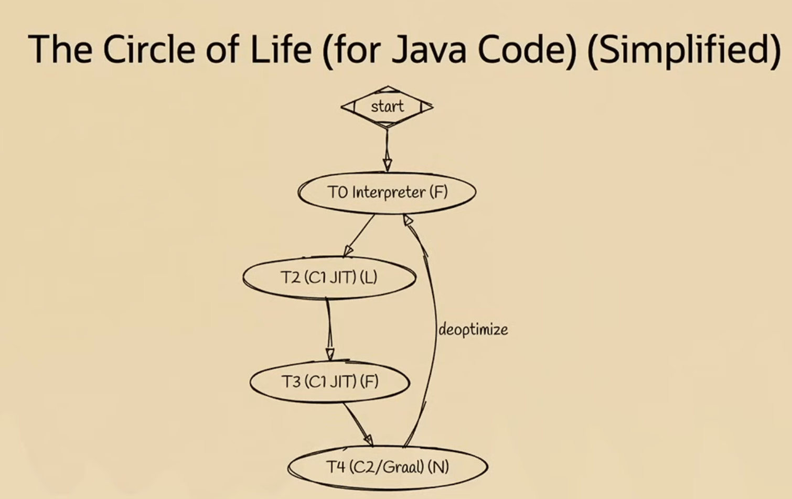

(1) 프로그램이 시작되면 JVM이 코드를 해석한다. 모든 바이트 코드를 살펴봄 (느림)

(2) (1)을 하는 동안, T2, T3에서 프로필 데이터를 수집한다. 메서드가 어떤 매개변수로 호출을 하고 있는지, 이 방법대로 몇번이나 호출하는지 등

(3) T4(CTO 컴파일러, Graal 컴파일러) 는 코드의 성능을 최적화 한다. (T2, T3에서 모든 프로파일 데이터가 수집됐을때 T4 진입)

→ 프로필 데이터가 모두 수집된 후 진입한 것이므로, T4 컴파일러는 이를 통해 추측 할 수 있음 (ex. 어떤 메서드의 파라미터가 계속 null인 상태로 호출되었다면, 다음에 호출될 때도 null인 파라미터로 호출되겠구나). 만약 그 추측이 틀렸다면 deoptimize한다.

## C2 컴파일러가 할 수 있는 최적화들

- inlining
- Loop Unrolling
- Hoisting
- Auto Vectorization (related SuperWord)
- Pre and post alignment
- Long to int looping conversion
- Aliasing, Control flow

### C2 컴파일러 성능 최적화 예시 - Original Code

아래와 같은 코드가 있다고 하자.

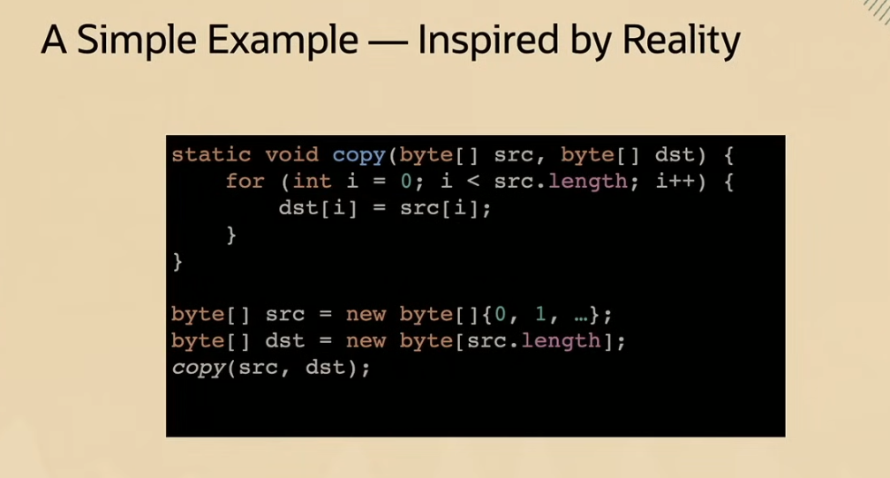

src 배열의 내용을 dst 배열로 복사하는 간단한 코드이다.

### Inlining

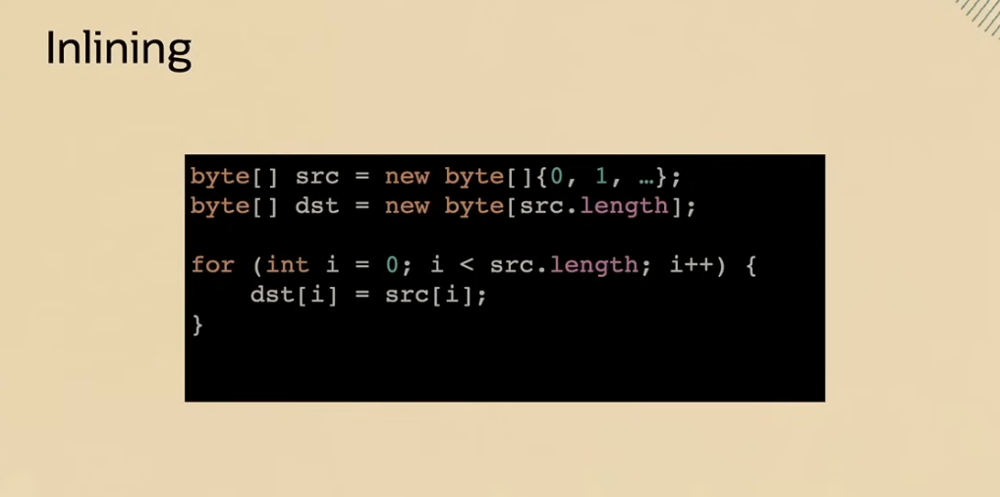

컴파일러가 인라이닝 최적화를 적용하면 위와 같은 코드가 된다.

실제 메서드 호출이 제거되었고, 이에 따라 메서드를 호출할 때 인자를 스택에 넣는 과정들도 생략된다.

### Loop unrolling

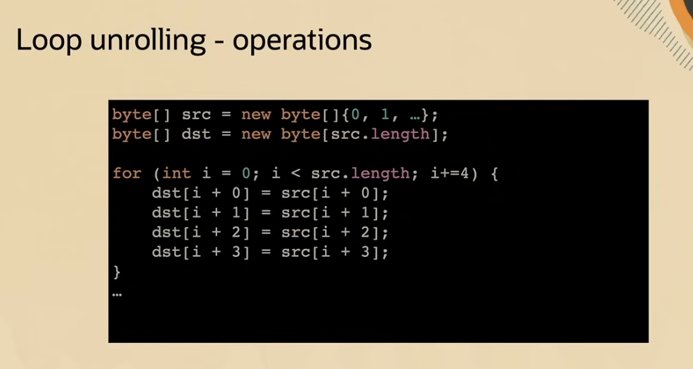

루프 언롤링 최적화가 적용되면 위와 같은 코드가 된다.

이렇게 되면 약간의 성능 향상이 있음

### Hoisting

루프 언롤링의 코드를 살펴보면, src, dst 배열에 대한 액세스에 인덱스 검사가 수반된다는 것을 알 수 있다.

만약 인덱스가 배열을 넘어가게 된다면, ArrayIndexOutOfBounds 예외가 발생할 것이다.

Hoisting 최적화를 통해 이 Exception 발생 시점을 끌어올릴 수 있다.

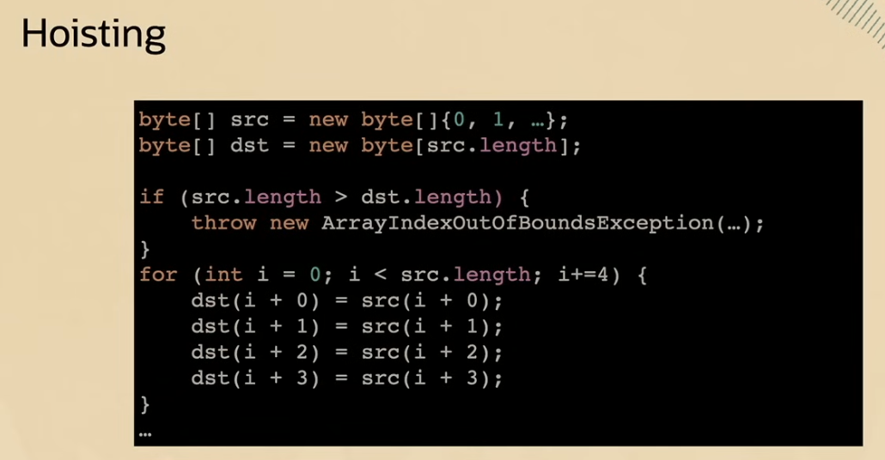

호이스팅이 적용되면 위와 같은 모습이 된다.

배열의 액세스마다 검사하지 않고, 위에서 src 배열의 길이와 dst 배열의 길이를 비교한 후 ArrayIndexOutOfBoundsException을 던지도록 하였다.

### AutoVectorization

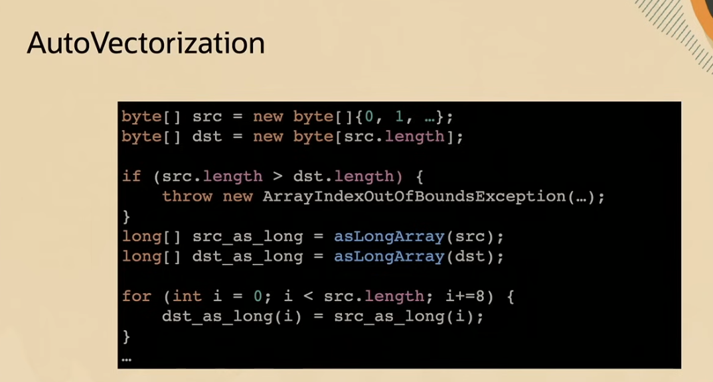

위 코드에서 asLongArray 메서드의 내용은 나타나있지 않지만, 바이트 배열의 long 배열 view를 반환하는 메서드이다.

그러면 8개 단위로 데이터를 처리할 수 있게 된다.

이런 4, 8 단위로 데이터를 처리하면 byte 배열을 처리하는 것보다 빠르다.

위 코드에 다시 호이스팅, 언롤링을 적용하면 아래와 같다.

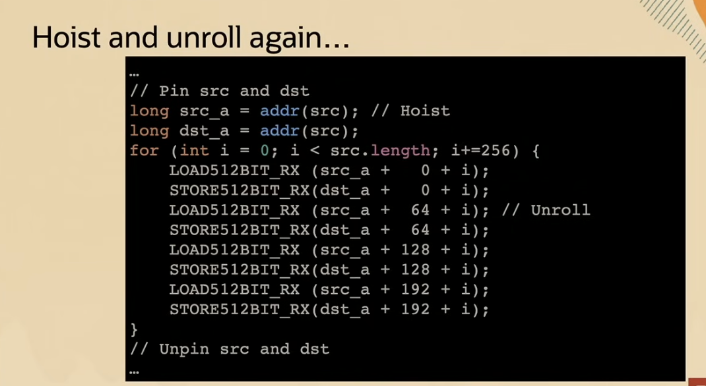

```java
long src_a = addr(src); // Hoist
long dst_a = addr(src);
```

이 부분을 보면 주소 계산을 루프 위로 끌어올려서 1번만 할 수 있게 하였다.

### Long to int looping conversion

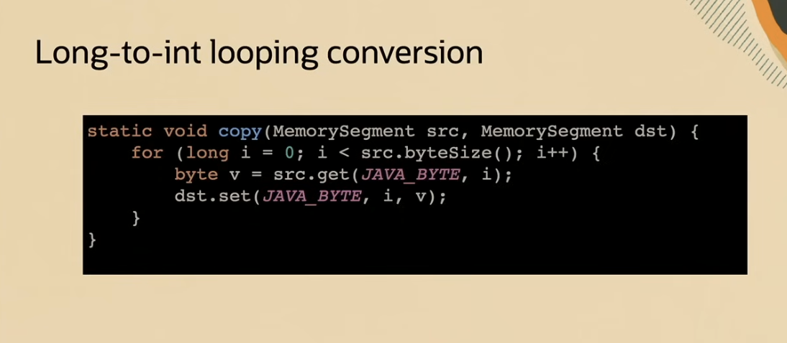

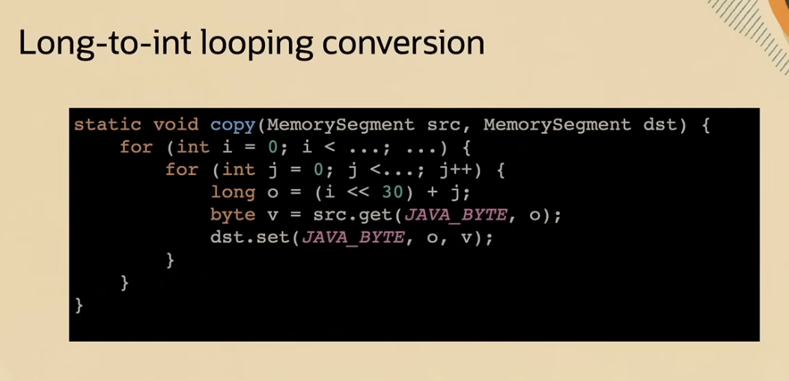

JDK22에서는 long 타입 for문을 int타입 for문으로 바꾸어줌으로써 최적화를 시켜준다.

long은 64비트, int는 32비트이므로, 메모리 사용량이 적고 CPU에서 더 빠르게 처리된다.

그리고 int타입을 일반적으로 JVM에서 더 잘 최적화 한다고 한다. (JIT(Just-In-Time) 컴파일러가 `int` 기반 루프를 더 빠르게 머신 코드로 바꿔줌)

gpt에게 부탁한 다른 예시

최적화 전

```java
long N = 10_000_000_000L; // 100억

for (long i = 0; i < N; i++) {
    // 작업 수행
    doSomething(i);
}

```

최적화 후

```java
long N = 10_000_000_000L;
int TILE_SIZE = Integer.MAX_VALUE; // 약 21억 (2^31 - 1)

for (long outer = 0; outer < N; outer += TILE_SIZE) {
    int innerLimit = (int) Math.min(TILE_SIZE, N - outer);

    for (int inner = 0; inner < innerLimit; inner++) {
        long i = outer + inner;
        // 작업 수행
        doSomething(i);
    }
}

```

### Aliasing


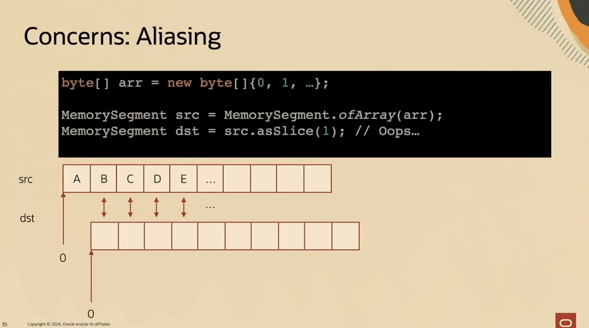

---

## Java 23, 24에서의 변화


Java 23은 2024년 9월, Java 24는 2025년 3월에 정식 릴리즈(General Availability)

### JDK-8318446: Merge Store


바이트 배열에 long타입을 담고 싶다면?

위 코드처럼 8번의 비트 이동이 필요하다. 이는 낭비가 발생한다.

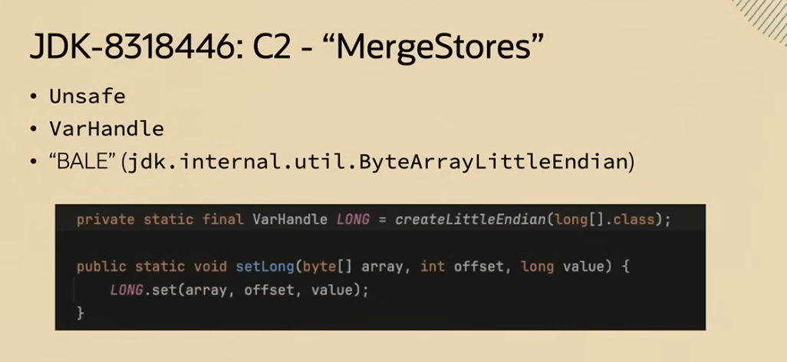

**MergeStores**:  Java JIT 컴파일러(C2)에서 사용하는 최적화 기법, **서로 인접하거나 관련된 메모리 저장(store) 연산들을 병합**하여 불필요한 메모리 접근을 줄이는 역할. 메모리 저장 연산이 중복되거나 쓸모없을 경우 제거하거나 하나로 합침

자바 23, 24에서는 Unsafe 또는 VarHandle을 통해 MergeStores 최적화가 제공되는 것 같다.

```java
private static final VarHandle LONG = createLittleEndian(long[].class);

public static void setLong(byte[] array, int offset, long value) {
	LONG.set(array, offset, value);
}
```

### JDK-8340821: API BulkOperations

외부 함수 메모리 벌크 연산

메모리 세그먼트를 이용하여 bulk operation의 성능 향상

메모리 세그먼트: 64비트의 데이터 연속 읽기를 추상화한 것

(Can be on or off heap이 무슨 말이지..? 힙에서도 되고 다른 영역에서도 된다는건가)

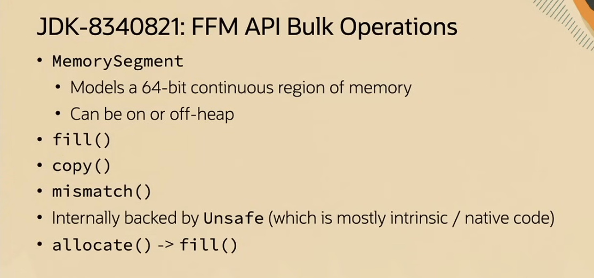

이 메모리 세그먼트를 활용해서 여러 메서드의 성능을 최적화 할 수 있다.

- fill: 세그먼트를 특정한 값으로 채우기
- copy: 세그먼트를 다른 세그먼트에 붙여넣기 할 수 있음
- mismatch: 세그먼트끼리 비교해서 다르면 -1리턴

참고로 새로운 메모리 세그먼트가 만들어지면 보안 상의 이유로 0으로 채워진다.

이런 것들은 Unsafe(기계어 코드 또는 네이티브 코드)에 의해서 뒷받침 되었다.

근데 이걸 Java로 대체했다고 함. 그리고 훨씬 빨라졌다.

**자바에서 네이티브 코드로 변환할 때는 오버헤드가 있다.**

**따라서 작은 값에서는 자바가 훨씬 빠르다.**

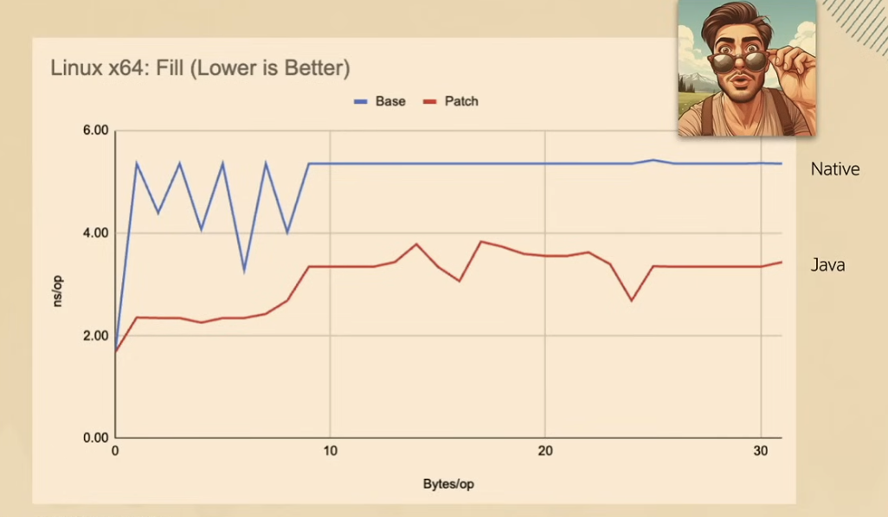

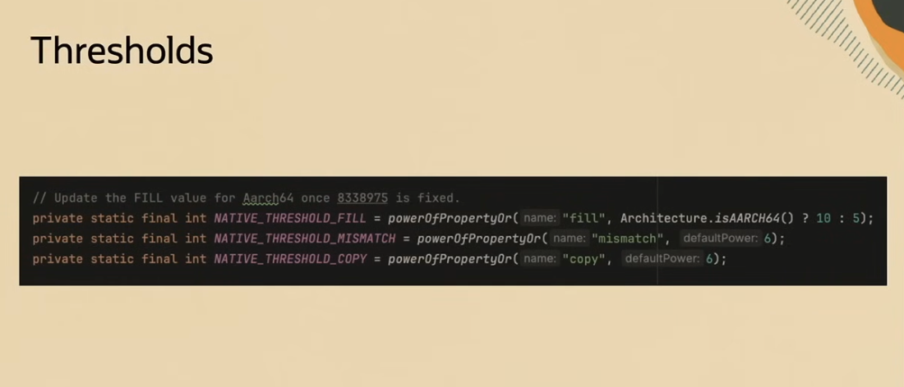

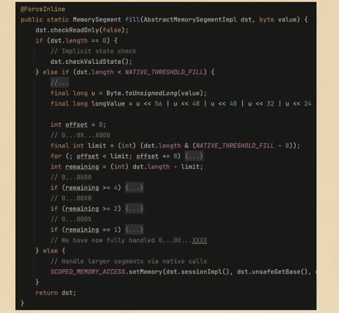

threshold를 정해서 값이 임계값(64)보다 작다면 자바에서 이를 처리하게 하고, 임계값보다 크다면 메모리 액세스를 호출하게 했다고 한다.