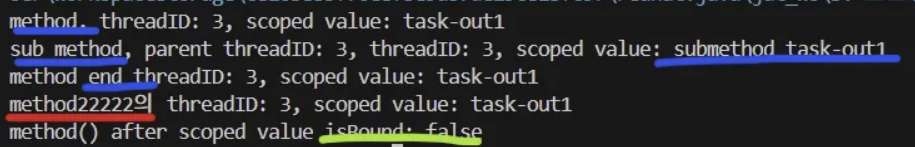
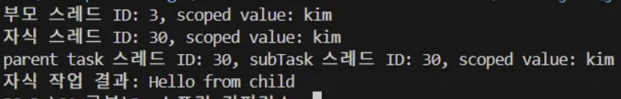

해당 내용은 https://general-mars-2e7.notion.site/scoped-value-structured-concurrency-1f8757b3e99180dd9842e54ba41d3ff0?pvs=4
에 정리되어있음.

# 1. Scoped Value

---

ThreadLocal의 한계를 보완하기 위해 나온 것으로 **불변 값을 특정 코드 블록(스코프) 내에서 안전하게 공유**할 수 있는 값이다.

따라서 가상 스레드, structured concurrency 환경에서 주로 사용된다.

멀티스레드 환경에서 사용되는 ThreadLocal는 스레드별로 값을 저장하지만, 스레드 종료 시 자동 해제되지 않기 때문에 메모리 누수가 발생한다.

또한, ThreadLocal은 값을 변경할 수 있다.

### scoped Value 특징

그래서 scoped values는 **불변 값을 가지며 동적 스코프, 특정 코드 블록 내에서만 접근할 수 있는 특징**을 가진다.

- 데이터 흐름 명확, 데이터 유효 범위 파악 쉬움

가상 스레드 환경에서 **스코프 내의 스레드 간 데이터 공유**를 할 수 있다.

스코프 종료 시 자동으로 값을 해제하여 스코프 밖으로 값이 누출 되지 않도록 한다.

## Scoped Value 동작 방식

---

스코프(코드 블록, 동작 범위)는 `try-with-resources` 구문으로 정의하고, 스코프가 끝날 때 값이 자동으로 해제된다.

```java
final static ScopedValue<String> SCOPED_VALUE = ScopedValue.newInstance();

	public static void main(String[] args) {
		normalMethod();
	}

	private static void normalMethod() {
		ScopedValue.where(SCOPED_VALUE, "task-out1").run(()->{
            method();
            method2();
        });
        System.out.println("method() after scoped value isBound: " 
			+ SCOPED_VALUE.isBound());
	}

	private static void method() {
		long threadId = Thread.currentThread().threadId();
		System.out.println("method, threadID: " + threadId +
			", scoped value: " + SCOPED_VALUE.get());
		ScopedValue.where(SCOPED_VALUE, "submethod " + SCOPED_VALUE.get())
			.run(() -> subMethod(threadId));
		System.out.println("method end threadID: " + threadId +
			", scoped value: " + SCOPED_VALUE.get());
	}

    private static void method2() {
		long threadId = Thread.currentThread().threadId();
		System.out.println("method22222의 threadID: " + threadId +
			", scoped value: " + SCOPED_VALUE.get());
	}

	private static void subMethod(Long parentThreadId) {
		long threadId = Thread.currentThread().threadId();
		System.out.println("sub method, parent threadID: " + parentThreadId +
			", threadID: " + threadId + ", scoped value: " + SCOPED_VALUE.get());
	}
```

위의 실습 코드는 다음과 같이 동작한다.

1. ScopedValue.where()로 SCOPED_VALUE값을 task-out1로 설정한다.
2. run()을 통해 해당 스코프 내에서 여러 함수를 실행한다.
    - method(), method2()를 호출하며 method()는 안에서 subMethod()를 호출하고 SCOPED_VALUE를 덮어쓴다.

**[출력 값]**


출력을 보면 스코프 안에 스레드는 1개이기 때문에 threadID는 어떤 함수에서 출력하더라도 3이다.

subMethod()에서 출력된 2번째 줄을 보면 scoped value 값이 submethod task-out1으로 바뀐 것을 알 수 있다.

⇒ 스코프 안에 **중첩된 스코프를 사용하여 내부 함수가 해당 값을 새로운 값으로 설정**하고, 내부 스코프 종료 후 외부의 값(task-out1)으로 돌아오는 것이 가능하다는 걸 알 수 있다.

마지막 출력 값을 보면, 스코프 종료 후 SCOPED_VALUE의 값은 해제되는 것을 볼 수 있다.

> 위 코드를 보면 scopedValue는 컨텍스트 값을 전파하기 위한 기능이기 때문에, 정확히 필요한 곳에만 사용하는 것이 가독성에도 좋다.
>

### 여러 값을 하나의 스코프에서 사용할 수 있다.

```java
// 여러 ScopedValue 선언
static final ScopedValue<String> USERNAME = ScopedValue.newInstance();
static final ScopedValue<Integer> USERAGE = ScopedValue.newInstance();

public static void main(String[] args) {
        // USERNAME과 USERAGE를 각각 설정하고 사용하는 스코프 설정
        ScopedValue.where(USERNAME, "Alice")
                   .where(USERAGE, 30)
                   .run(() -> {
                       prinfUser();
                       printUserAge();
                   });
}
```

where() 메서드를 통해 scoped value를 체이닝할 수 있다.

이때, 각각의 scoped value는 서로 영향 주지 않고 독립적으로 값을 관리한다.

## 1.2 threadLocal, scoped value

# 2. Structured concurrency

---

그렇다면 structured concurrency가 무엇이냐?

여러 개의 동시 작업을 **하나의 블록 내에서 관리**하여 에러 처리를 단순화하고 안전하게 종료 및 취소하는 것을 보장하는 것이다.

**즉, 동시 작업이 부모 컨텍스트에 속하고, 생명 주기가 구조화된 트리 형태가 된다.**

기존 스레드 프로그래밍은 스레드 생성과 종료가 흩어져 실행 흐름과 오류 처리가 분산 되기 때문에 작업 간의 협력이 복잡하다.

이로 인해 가독성도 저하되며 유지 보수가 어려운 문제가 발생한다.

## 2.1 동작 방식

`StructuredTaskScope` 를 통해서 구조화된 동시성을 지원한다.

- `ShutdownOnFailure` : 하나의 작업이라도 실패하면 다른 작업들을 종료
- `ShutdownOnSuccess` : 한 작업이라도 성공하면 다른 작업 종료

**🚨주요 메서드**

- fork(Callable<T>): 병렬 작업 생성
- join(): 모든 작업이 종료될 때까지 대기
- throwIfFailed(): 실패한 작업이 있으면 예외 발생

```java
import java.util.concurrent.*;
import jdk.incubator.concurrent.StructuredTaskScope;

public class StructuredConcurrencyExample {

    public static void main(String[] args) throws Exception {

        try (var scope = new StructuredTaskScope.ShutdownOnFailure()) {

            Subtask<String> userTask = scope.fork(() -> fetchUserData());
            Subtask<String> orderTask = scope.fork(() -> fetchOrderData());

            scope.join();               // 모든 작업 종료 대기
            scope.throwIfFailed();      // 실패한 작업이 있으면 예외 발생

            String userData = userTask.get();
            String orderData = orderTask.get();

            System.out.println("User: " + userData);
            System.out.println("Order: " + orderData);
        }
    }

    static String fetchUserData() throws InterruptedException {
        Thread.sleep(1000);
        return "User123";
    }

    static String fetchOrderData() throws InterruptedException {
        Thread.sleep(1500);
        return "Order456";
    }
}

```

1. `StructuredTaskScope` 스코프 생성
    - 보통 try-with-resources 구문으로 만든다.
2. `fork()` 로 병렬 작업을 생성하고 실행한다.
    - `Future` 타입으로 작업 결과를 받을 수 있음.
    - scope.fork()로 생성한 작업은 **해당 scope 내에서 관리 되고 작업이 끝날 때까지 추적됨**.
3. `join()` 을 통해 위에서 생성한 모든 작업 종료를 기다린다.
4. 필요하다면 예외 처리 및 결과를 수집한다.
5. 스코프가 종료되면 관련 리소스 해제된다.

### 구조화된 동시성의 이점

- **명확한 작업 생명 주기, 소유권**를 통해 디버깅 및 유지 보수 용이
- 일관된 오류 처리 가능
- 스코프 내에서만 작업하고 해제되기 때문에 자원 누수를 방지할 수 있다.
- 함수 호출 구조와 유사하기 때문에 코드 가독성이 향상된다.

<aside>
🚨

**구조화된 동시성 설계 시 주의 점**

- 동시 작업은 scope 내에서 생성, scope 끝나기 전에 반드시 종료
- 부모 작업은 자식 작업의 종료를 기다리고, 실패 시 예외 처리
</aside>

## 구조화된 동시성이 적합하지 않은, 주의가 필요한 케이스

1. 초단기, 고빈도 작업
    - 작업 시간이 짧거나, 빈번한 경우 구조적 동시성의 스코프 관리 및 join() 대기로 인해 오버헤드가 크다.
2. 무한, 장시간 실행 작업
    - 구조적 동시성은 무조건 스코프 종료 시점에 모든 작업을 종료해야 하기 때문에 적합하지 않음
3. 비동기 이벤트 기반 아키텍처
4. 동시성 범위가 불명확하거나, 작업 생성 소멸 시점이 동적으로 변화하는 경우
5. 비구조적 동시성(completableFuture, ExecutorService)로 구현된 코드와의 혼용 문제

# 3. scoped value + structured concurrency

---

즉, 스레드 간의 데이터 공유와 안전한 전파를 목적으로 하는 structured concurrency에 스코프 내에서만 유효한 데이터를 제공하는 scopedValue는 유용할 수 밖에 없다.

## 3.1 실습 코드

```java
final static ScopedValue<String> SCOPED_VALUE = ScopedValue.newInstance();

	public static void main(String[] args) {
		ScopedValue.where(SCOPED_VALUE, "kim").run(() -> {

            System.out.println("부모 스레드 ID: " + Thread.currentThread().threadId() 
                + ", scoped value: " + SCOPED_VALUE.get());

            try (var scope = new StructuredTaskScope.ShutdownOnFailure()) {

                var childTask = scope.fork(() -> task());

                scope.join();
                scope.throwIfFailed();

                System.out.println("자식 작업 결과: " + childTask.get());
            } catch (Exception e) {
                e.printStackTrace();
            }

        });
	}

    private static String task(){
        long currentThread = Thread.currentThread().threadId();
        System.out.println("자식 스레드 ID: " + currentThread + ", scoped value: " + SCOPED_VALUE.get());
        subTask(currentThread);

        return "Hello from child";
    }

    private static void subTask(Long parentThread){
        System.out.println("parent task 스레드 ID: "+ parentThread +", subTask 스레드 ID: " + Thread.currentThread().threadId() + ", scoped value: " + SCOPED_VALUE.get());
    }
```


이를 보면, 부모 스레드(현재 실행 중인 main)가 자식 스레드를 생성하였는데 scoped value의 값은 kim으로 똑같았다.

**⇒ 부모, 자식 스레드 간에는 scoped value가 상속된다.**

또한 단순 호출된 subTask도 task(자식 스레드)와 같은 스코프에서 호출되었기 때문에 같은 scoped value 값을 가진다.

구조화된 동시성에서 scoped value는 똑같이 동작하기 때문에 내부 스코프를 생성 후 scoped value를 재정의해서 다른 값을 사용할 수 있다.

## 3.2 threadLocal vs scoped value

위에서 scoped value는 부모-자식 스레드 간 상속이 되지만, 별개의 독립 스레드의 경우에는 명시적 스코프 설정이 되어 있어야 공유할 수 있다.

| 구분 | ThreadLocal | Scoped Value |
| --- | --- | --- |
| **값의 생명주기** | 해당 스레드가 살아있는 동안 유지 | 해당 스코프(즉, 실행 블록) 내에서만 유지 |
| **스레드 종료 시** | 값이 사라지고 접근 불가(해제를 누락했을 경우는 남아있게 됨) | 스코프 종료와 함께 값도 사라짐 |
| **접근 가능 범위** | 같은 스레드 내 어디서나 가능 | 현재 스코프 및 하위 호출 스코프 내에서만 가능 |
| **자동 관리 방식** | 스레드별 저장소 | 스코프 단위로 값 설정 및 해제 자동 처리 |
| **부모-자식 스레드 간 데이터 공유** | 자동 상속 없음, 수동 전달 | **가상 스레드 환경에서 자동 상속 지원** |

## 3.3 가상 스레드와 scoped value

맨 위에서 scoped value는 가상 스레드에서 강력하다고 했다.

이유는 가상 스레드 환경에서만 부모-자식 스레드 간 자동 상속이 지원되기 때문에 가상 스레드끼리 자연스러운 값 공유 및 경량화가 가능하다.

반면, os 스레드(플랫폼)의 경우 부모-자식 관계이더라도 scoped value 값이 자동 전달되지 않는다.

명시적으로 값을 읽어서 새로운 스레드에서 scoped value를 다시 설정해야 한다.