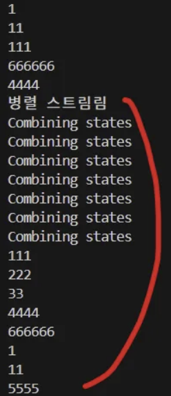
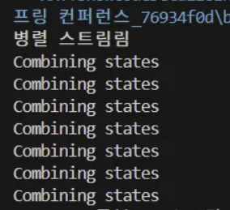

해당 내용은 https://general-mars-2e7.notion.site/Stream-Gatherers-1f7757b3e991806f9ca0fe63c470a931?pvs=4
에 정리되어있음.

# StreamGatherer
Stream API에서 **중간 연산** 전용으로 사용되는 인터페이스이다.

```java
Gatherer<T,A,R> gather = Gatherer.of(
	initializer(),
	integrator(),
	combiner(),
	finisher()
)
```

- T : 입력 타입
- A: 내부 상태를 추적하기 위한 accumulator 타입
- R: 출력 타입
- 메소드
    - **initializer()**: 내부 상태 객체를 생성 ⇒ **accumulator 객체를 초기화**한다.
        - 선택 사항임. stream의 중간 연산자는 stateless, stateful도 있기 때문.
        - Supplier<A>
        - 상태 공유 없음. 각 스레드, 청크마다 생성됨.(병렬 stream에서 사용시)
    - **integrator()**: 입력 요소를 처리하고, 필요에 따라 출력 요소를 생성
        - Integrator<T,A,R>이며 입력값 → 상태 업데이트 + 출력하는 것임.
    - **combiner()**: **병렬 처리 시 내부 상태 객체를 병합**
        - BinaryOperator<A>
        - **순수 함수로만 작동**
    - **finisher()**: 스트림 종료 시 최종 작업을 수행
        - 상태 기반을 마무리하는 것으로 원소 재처리 X
        - downstream에 접근 가능하여 지연 처리된 작업을 방출 할 수 있다.
- andThen()를 통해 gatherer를 모아서 실행할 수 있다.
    - `stream().gather(a).gather(b).gather(c).collect();` = `stream().gather(a.andThen(b).andThen(c)).collect();`

gatherer안에 있는 combiner()를 보면 Gatherer는 병렬 스트림에서 사용할 수 있다는 걸 알 수 있다.

병렬 환경에서는 **각 스레드마다 integrator(상태)를 생성**하고, 작업 후 combiner()를 통해 **상태를 병합**하기 때문에 상태 공유가 제어된 방식으로 이루어진다.

- gatherer는 상태 공유에 대해서 안전함

```
             +-------------------+
  Data --->  | **integrator**        |  (각 스레드, 각 청크 단위)
             +-------------------+
                      |
        +-------------+-------------+
        |                           |
  Set<Integer> A1           Set<Integer> A2  ... (각 스레드 결과)
        \                           /
         \_________________________/
	                **combiner**
	                    ↓
              Set<Integer> merged
	                    ↓
		               **finisher**

```

❓**만약 병렬 처리 시 integrator 재호출이 필요한 구조였다면?**

gatherer의 설계 자체가 잘못된거임.

병합이 끝난 후 원소가 무엇이었는지 gatherer는 기억하지 않기 때문에 병합 과정에서 원소를 다시 처리해서는 안된다.


## 실습 - 문자열 길이 기준 중복 제거

```java
List<String> strList = List.of("1","11","111","222","33","666666","4444", "5555");
        
        Gatherer<String, Set<Integer>, String> gather = Gatherer.of(
            HashSet::new, 
            (seenLengths, str, downStream) ->{
                if(seenLengths.add(str.length())){
                    downStream.push(str);
                }
                return true;
            },
            (left, right) -> {
                System.out.println("Combining states"); // 확인용 로그
                left.addAll(right); 
                return left;
            },
            (seenLengths, downStream) -> {}
        );
        
        strList.stream()
            .gather(gather)
            .forEach(System.out::println);
            
        System.out.println("병렬 스트림림");
        strList.parallelStream()
            .gather(gather)
            .forEach(System.out::println);
```

위 코드에서 combiner()가 구현되어있을 때, 일반(순차) 스트림과 병렬 스트림에서 gatherer를 실행해보면 다음과 같이 출력 된다.



### 병렬 스트림

**출력을 보면 combiner()가 구현되어 있더라도 병렬 스트림일 경우에만 호출된다는 걸 알 수 있다.**

- 순차 stream에서는 integrator만 실행되고 상태는 공유가 되지 않는다는 것임.

만든 gatherer의 순차 처리만 허용하고 싶다면(gatherer를 병렬 stream에서 사용하지 않도록 막기 위해서) combiner()에서 예외를 던지도록 하면 된다.

```java
Gatherer<String, ?, String> sequentialOnlyGatherer = Gatherer.of(
    ...,
    ...,
    (left, right) -> {
        throw new UnsupportedOperationException("This gatherer must be used with sequential streams");
        //대신 return left;를 할 수 있으나 이렇게 하면 결과가 이상하게 나올 수 있음.
    },
    ...
);
```

또한, 병렬 스트림에서 사용할 경우, 병렬성을 고려해서 설계되어야 한다는 걸 알 수 있다.

### Gatherer vs Collector

위 예시를 보면 gatherer는 입력 스트림을 조작해서 새로운 출력 스트림을 만들어주는, **스트림 흐름을 제어하고 스트림 변형이 목적이라는 걸 알 수 있다. ⇒ 입력 스트림을 최종 결과로 만드는 Collector의 터미널 연산과 다름.**

- 반환 타입: Stream<R>

gatherer 흐름 중간에 `push()` 를 이용해서 downstream으로 element를 하나씩 전달하는 것을 알 수 있다.

즉, gatherer는 스트림 흐름 조작, 중간 연산 API, collector는 스트림 결과 생성, 터미널 연산이다.

### downstream, push()

위 코드에서 downstream이 나오는데 이는 **후속 처리기**라고 생각하면 된다.

즉, 현재 단계 다음에 위치한 연산자를 가르키는, integrator()같은 내부 로직에서 **입력 요소를 처리하고 결과를 다음 연산 단계로 전달할 때 사용하는 인터페이스**이다.

위 실습에서 downstream.push()를 제거하고 실행하면 다음과 같이 출력된다.


즉, downstream은 gatherer 다음에 위치한 스트림 처리 단계를 가르키고, push()를 통해 다음 단계로 값을 전달한다.

- **downstream = 출구**

# stream gatherer의 동작 흐름

```
Stream 요소 →
integrator(state, element, downstream) 호출 →
  내부 상태 갱신 →
  필요 시 downstream.push(가공된 값) →
다음 스트림 연산자 →
(병렬 시) combiner로 상태 병합 →
(스트림 종료 시) finisher 실행 → 
마지막 downstream.push() →
터미널 연산으로 결과 출력
```

# Gatherer4j

https://todd.ginsberg.com/post/java/gatherers/

gatherer4j라는 프로젝트, 여러 커스텀 gatherer 라이브러리를 만든 사람의 글이다.

gatherer4j를 보면 다양한 gatherers를 볼 수 있다.
