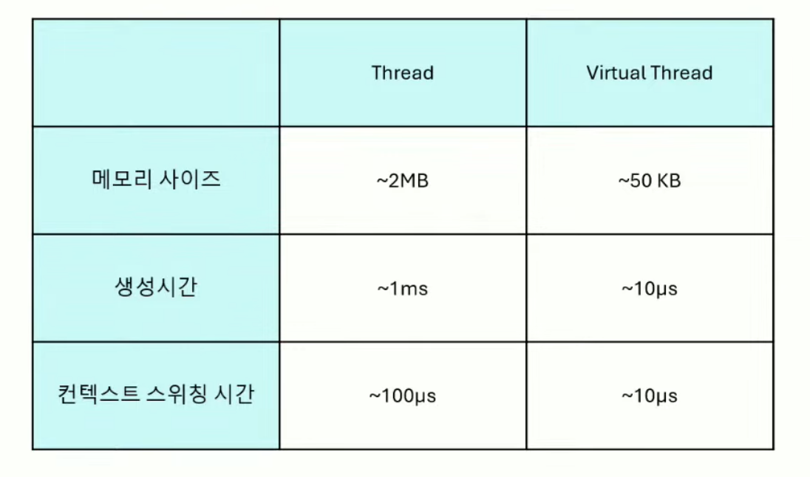

# Java의 미래, Virtual Thread

# Virtual Thread 소개

- 2018년 Project Loom으로 시작된 경량 스레드 모델
- 2023년 JDK21에 정식 feature로 추가
- 스레드 생성 및 스케줄링 비용이 기존 
- 스레드보다 저렴 스레드 스케줄링을 통해 Nonblocking I/0 지원 
- 기존 스레드를 상속하여 코드 호환

## Virtual Thread 장점

- 기존 자바 스레드는 생성 비용이 큼
    - 스레드 풀의 존재 이유
    - 사용 메모리 크기가 크다
        - 최대 2MB 까지 사용함
    - OS에 의해 스케줄링
        - 스케줄링 과정에서 항상 OS 와 통신해야하기 때문에 시스템콜이 계속발생함
- Virtual Thread 는 생성 비용이 작음
    - 스레드 풀의 개념이 없음
    - 50kb 까지만 사용됨
    - OS가 아닌 JVM 내 스케줄링

Non Blocking I/O 를 지원

- JVM 스레드 스케줄링
- Continuation 활용
- 기존 스레드를 상속함
    - 기존스레드로 작동하고 있던곳에 Virtual Thread를 적용시켜도 잘 작동함

## 일반 스레드 특징

- 플랫폼 스레드
- OS에 의해 스케줄링 
- 커널 스레드와 1:1 매핑
- 작업 단위 Runnable

.png)

Virtual Thread 특징

- 가상 스레드
- JVM에 의해 스케줄링
    - DEFAULT_SCHEDULER 는 ForkJoinPool 이며 static 으로 선언되어 모든 Virtual Thread가 공유함
    - Thread는 생성 및 스케줄링 시 커널 영역에 접근하지만 Virtual Thread는 단순 Java 객체 생성이라 시스템 콜이 발생하지 않음
- 캐리어 스레드와 1:N 매핑
- 작업 단위 Continuation

.png)

.png)

.png)

.png)

.png)

Virtual Thread 는 ForkJoinPool 에서 Carrier Thread 들에 의해 스케쥴링 되며, Carrier Thread 는 사용가능한 프로세서 만큼 생성됨

### Continuation 작업단위

- 실행가능한 작업흐름
- 중단가능
- 중단 지점으로부터 재실행 가능

.png)

LockSupport.park()

- Thread 를 yield 시키기 위해서는 LockSupport 의 park 메소드를 실행시켜야함
    - 현재 스레드가 Virtual Thread 일때는 VirtualThreads.park(); 
    - 플랫폼 스레드 일때는 U.park(); → U 는 Unsafe 로 native method 로 커널스레드를 park 시킴

Continuation 사용 이유

- Thread는 작업 중단을 위해 커널 스레드를 중단
- Virtual Thread는 작업 중단을 위해 continuation yield
    - 작업이 block 되어도 실제 스레드는 중단되지 않고 다른 작업 처리 -> NIO
    - 커널 스레드 중단이 없으므로 시스템 콜 x-> 컨텍스트 스위칭 비용이 낮음

# 주의사항

## Blocking carrier thread(Pin)

캐리어 스레드가 블록킹되는 현상을 Pin 현상이라고 함

- 캐리어 스레드를 block하면 Virtual Thread 활용 불가
    - synchronized
    - parallelStream
- VM Option으로 감지 가능
    - \-Djdk.tracePinnedThreads=short, full
- 병목 가능성이 존재 
- 사용 라이브러리 release 점검
- 변경 가능하다면 java.util의 ReentrantLock을 사용하도록 변경

## No Pooling

- 생성비용이 저렴하기 때문
- 사용할때마다 생성
- 사용완료 후 GC

## 경량 스레드

- 수백만개의 스레드 생성 컨셉
- Thread Local을 최대한 가볍게 유지하여야함
    - Thread Local에 무거운 값들이 들어가면.. 경량 스레드의 장점을 살릴 수 없음
- 쉽게 생성 및 소멸
- JDK21 preview ScopedValue
    - VIrtual Thread에서는 ThreadLocal 대신 이걸 쓰면 좋다고함
- Virtual thread는 배압조절 기능이없다
    - 유한 리소스의 경우 배압을 조절하도록 설정 (DB커넥션, 파일)
    - 충분한 성능테스트 필요

# 결론 

- Virtual Thread는 가볍고, 빠르고, nonblocking인 경량 스레드
- Virtual Thread는 JVM 스케줄링 + Continuation
- Thread per request 사용중이고, I/O blocking time이 주된 병복인 경우 고려
- 쉽게 적용가능
    - Reactive가 러닝커브로 부담되는 경우
    - Kotlin coroutine이 러닝커브로 부담되는 경우

# 궁금증

### Pinning 이 뭘까?

- Virtual Thread가 Carrier Thread 에서 언마운트되지 못하고 고정된 현상

### Carrier Thread  에서 언마운트 하지 못했다는건 뭘까?

- Unmount 란 Virtual Thread 는 자신의 **Continuation**(실행 스택·상태) 를 JVM 내부에 저장, 보관(park) 하고 그 자리의 Carrier Thread 를 풀어주는 것을 말함
    - 즉 Continuation 를 힙에 직렬화하고, Carrier Thread 를 다른 가상 스레드에 재할당 해주는 것이 Unmount
    - 강의에 나온 그림이랑 같이보면 이해가 쉬움

.png)

## 언제 Pinned 상태가 될까?

- **`synchronized` 블록 또는 메서드** 내부 실행 시
    - Java의 `synchronized`는 **모니터(Monitor)** 라는 원시 동기화 구조 위에 구현됨
        - 각 객체의 헤더에는 **mark word**가 있어, 이 필드에 모니터 소유자 정보를 기록하는데, 이때 JVM은 **플랫폼 스레드(Platform Thread)** 의 식별자를 소유자로 저장함
        - 가상 스레드(Virtual Thread)가 `monitorenter` 바이트코드를 만나 모니터를 획득하면, JVM은 해당 가상 스레드의 **Carrier Thread**(=플랫폼 스레드)를 모니터의 소유자로 등록
    - 만약 가상 스레드가 `synchronized` 내부에서 언마운트(unmount)되어 Carrier Thread가 바뀌면, 새로운 Carrier Thread가 이미 획득된 모니터를 소유한 것으로 잘못 인식될 수 있기 때문에, JVM 은 `synchronized` 블록 내부에 있는 동안은 절대 언마운트되도록 Pinned 됨
- parallelStream 와 사용시
    - Carrier Thread와 ForkJoinPool의 공유
        - `parallelStream()`도 **Common ForkJoinPool**을 사용하기 때문에 Virtual Thread의 Carrier Pool과 parallelStream의 실행 풀이 같은 work-stealing 메커니즘을 공유하거나, 실질적으로 동일한 풀을 쓰게 되는 경우가 많음
    - CPU 바운드 작업과 Continuation 언마운트 부재
        - virtual Thread 는 I/O 같은 명시적 블록 지점을 만나면 Continuation을 unmount 하고 Carrier Thread 를 풀로 반환함
            - 하지만 `parallelStream()`으로 분할된 각 작은 작업은 대부분 **CPU 바운드**(정렬, 집계 등)여서, JVM이 Continuation을 떼어낼 만한 블록 지점을 찾지 못함
                - 결국 언마운트가 발생하지 않아 Continuation이 Carrier Thread 에 고정된 채로 남아있게 됨

- **네이티브 메서드(native) 호출** 또는 외부 FFI(Foreign Function Interface) 실행 시
    - virtual thread가 `native` 메서드를 호출하면 실행 흐름이 JVM 제어 밖인 네이티브 코드 영역으로 넘어가는데, 이 구간에는 Continuation을 heap 위로 직렬화(park)했다가 다시 복구(mount)할 수 있는 “블록 포인트”가 정의되어 있지 않아서 JVM은 Continuation 언마운트를 수행할 수 없음
    - 네이티브 호출 과정에서는 OS 스레드의 식별자와 스레드 로컬 저장소(TLS)가 긴밀히 연동되는데, Continuation을 떼어내 Carrier Thread를 바꿀 경우 JNI 콜백, TLS 일관성, 네이티브 스택 레이아웃 등이 깨질 위험이 있습니다. 이 때문에 JVM은 네이티브 호출이 끝날 때까지 Continuation을 분리하지 않고 고정(pinned) 상태로 유지함

### JDK 24 에서는 synchronized 블록 내에서 Virtual Thread 가 unmount 될 수 있도록 개선됨

## 1. 모니터 소유권 구조 변경

- **기존 모델**
    - JVM은 객체 헤더의 **mark word**에 OS 스레드 ID를 기록해 모니터 소유자를 관리
    - Virtual Thread가 `synchronized` 진입 시 해당 Carrier Thread의 ID가 mark word에 저장되어, 모니터 소유자가 플랫폼 스레드로만 인식됨 .
- **JEP 491 변경점**
    - `monitorenter` 수행 시 **Virtual Thread ID**와 Continuation 정보를 VM 내부 구조체에 기록하고, mark word에는 “가상 스레드 소유”를 나타내는 플래그만 설정
    - 이로써 소유권 정보는 VM 데이터 구조에서 관리되어, Continuation 언마운트 시점에도 모니터 일관성을 보장할 수 있게 됨 .

## 2. 언마운트·재마운트 시점의 북키핑 로직

1. **모니터 획득(`monitorenter`)**
    - HotSpot 인터프리터 및 JIT 스텁에 가상 스레드용 분기 추가
    - 블록팅 지점(예: I/O, `Object.wait()`, 네이티브 콜백)에서 Continuation을 **park**하고 Carrier Thread를 해제
1. **모니터 해제(`monitorexit`) 및 `Object.wait()`**
    - 해제 시 VM 내부에서 모니터 소유 정보 제거
    - `Object.wait()` 대기 시 Continuation을 언마운트 후 대기 큐에 등록
    - `notify()/notifyAll()` 후 JDK 스케줄러가 해당 Virtual Thread를 적절한 Carrier Thread에 **재마운트**하여 실행 재개 .

## 3. 진단 및 호환성 개선

- **JFR 이벤트**
    - 기존 `jdk.VirtualThreadPinned`는 `synchronized` 내부 블록킹을 모두 기록했으나, JEP 491 적용 후에는 **네이티브/FFI에 의한 Pinning만** 기록하도록 변경 .
    - 시스템 프로퍼티 `jdk.tracePinnedThreads`는 더 이상 필요 없어지고 제거됨 .
- **JVMTI 의존성**
    - `GetObjectMonitorUsage` 함수 사양 변경(Java 23부터): Virtual Thread 소유 모니터 정보 반환 비활성화 → 별도 VM 내부 북키핑으로 대체 .

같이 보면 좋을글

[Java 21 Virtual Threads - Dude, Where’s My Lock?](https://netflixtechblog.com/java-21-virtual-threads-dude-wheres-my-lock-3052540e231d)

