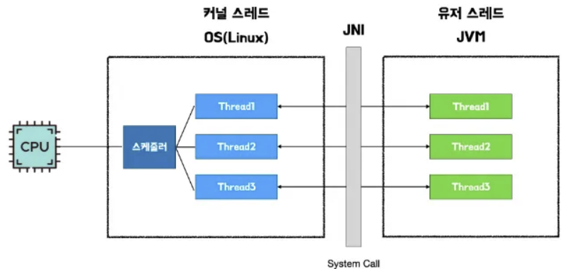
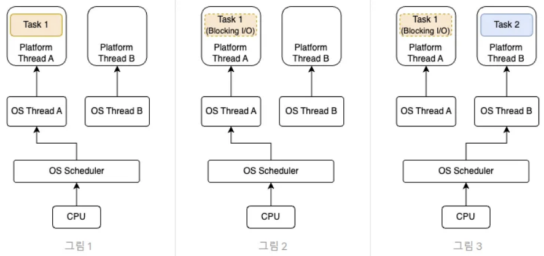
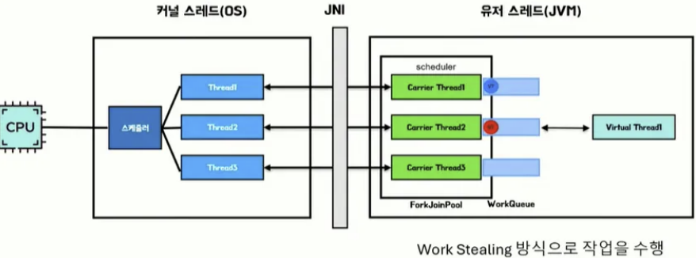
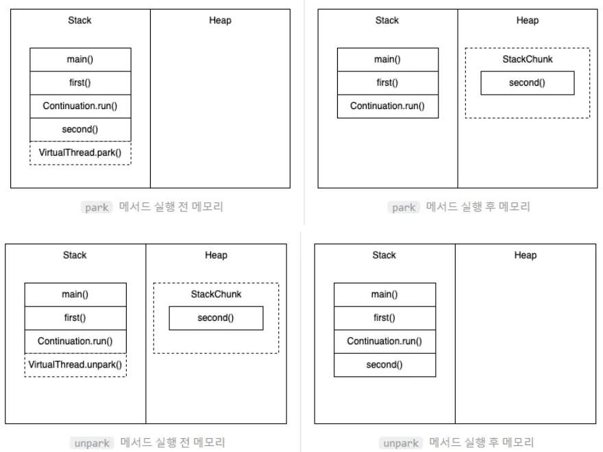

# 1. 가상 스레드 등장 배경

---

기존 Java의 스레드 모델(platform thread)은 OS 스레드와 1:1 매핑이 되는 OS 스레드의 Wrapper였다.


따라서 thread per request 방식의 스프링 서버의 경우 네트워크 요청, 파일 쓰기 와 같은 I/O 작업을 만나게 되면 CPU를 OS에 반환하고 작업이 완료될 때까지 blocking 된다.


위 그림처럼 blocking I/O 작업이 수행되면서 해당 os thread는 대기 상태가 되고 새로운 스레드가 CPU를 선점하여 작업을 실행하게 된다.

이때, OS 레벨 단의 컨텍스트 스위칭이 발생한다.

- 메모리가 제한된 환경에서 생성할 수 있는 스레드 수에 한계가 있음.
- OS 레벨 단의 컨텍스트 스위칭 비용이 증가

이런 한계로 인해 OS 스레드와 일대일 대응 되지 않으며, 경량화된 virtual thread가 등장하게 되었다.

# 2. virtual thread 동작 원리

---

가상 스레드는 캐리어 스레드(기존의 플랫폼 스레드임)에 1:N으로 매핑된다.

여기서 실제로는 캐리어 스레드 하나에 하나의 가상 스레드가 동작하지만, workQueue에 가상 스레드들이 들어있기 때문에 1:N이라고 함.

캐리어 스레드에 가상 스레드를 매핑하기 위해서 `ForkJoinPool`로 되어있는 스케줄러가 work stealing 방식으로 큐에서 가상 스레드를 가져온다.



가상 스레드는 아래와 같이 5개의 인스턴스가 있으며 이것들이 주요한 역할을 한다.

```java
// java.lang.VirtualThread.java
final class VirtualThread extends BaseVirtualThread {
    private final Executor scheduler;
    private final Continuation cont;
    private final Runnable runContinuation;
    private volatile int state;
    private volatile Thread carrierThread;
}
```

여기서 scheduler는 가상 스레드가 사용하는 스케줄러의 참조 값이 저장된다.

> 스케줄러: 가상 스레드를 캐리어 스레드와 연결하는 아이
>
- Continuation은 실행해야 할 작업 정보를 저장하는 변수
- runContinuation은 cont 변수의 run 메서드를 실행하는 함수의 참조값
- state는 가상 스레드의 현재 상태
- carrierThread는 위에서 말했듯이 매핑되어있는 플랫폼 스레드 참조값

## Continuation

conitnuation은 가상 스레드의 실행 상태에 대한 캡슐화된 객체라고 볼 수 있다.

- 프로그램 카운터, 스택 프레임, 지역 변수 등 런타임 상태를 묶은 객체

가상 스레드를 한 번 실행하고 중단 후에 다시 실행할 때 **continuation의 지점부터 다시 실행하게 된다**.

즉, 가상 스레드의 실행 흐름을 멈추고 이어갈 수 있는 추상화된 실행 단위로서 가상 스레드의 순차 코드 유지, 경량성, 비동기 I/O 지원을 가능하게 하는 핵심 요소이다.

### 왜? 핵심 요소이냐?

continuation은 blocking API 호출 시 JVM이 `park`를 수행하면서 호출 지점 직전까지의 스택 상태를continuation 형태로 힙에 보관한다.

I/O 완료 후 unpark 되면 힙에 있던 정보가 스택으로 넘어오고 해당 정보를 통해 **멈춘 지점부터 다시 실행**할 수 있게 된다.




또한, continuation은 전체 스택을 유지하는 것이 아니라 `_cont_stack_bottom` , `_cont_stack_top` 범위만 힙에 저장하여 메모리를 절감시킨다.

```
             +----------------------------+
            |   carrier frames           |
            |----------------------------|
            |    Continuation.run        |
            |============================|
            |    enterSpecial frame      |
        ^   |============================| <-- (5) JavaThread::_cont_entry
   (+)  |   |  ? alignment word ?        | <-- (6)
        |   |----------------------------| <--\ (4) _cont_stack_bottom
        |   |                            |    |
        |   |  ? caller stack args ?     |    |  
Address |   |                            |    |  
        |   |----------------------------|    |
        |   |    frame                   |    |
        |   +----------------------------|     \__ Continuation frames
   (-)  |   |    frame                   |     /   
        |   |----------------------------|    |
            |    frame                   |    |
            |----------------------------| <--/ (1) _cont_stack_top
            |    doYield/safepoint stub  | <- (3) doYield_stub_frame_size
            |============================| <- (2) the sp passed to freeze
            |  Native freeze/thaw frames |
            +----------------------------+
```

### 동작 흐름

1. `continuation.yield()` 실행
2. park 처리와 함께 cont에 현재 분할 스택 세그먼트와 레지스터를 저장
3. carrier 스레드는 다른 continuation을 실행하도록 반환
4. I/O poller나 스케줄러가 I/O가 완료된 continuation을 workQueue에 다시 삽입한다.
5. carrier 스레드가 `cont.run()` 을 호출하여 저장된 상태 그대로 실행한다.

```
[VirtualThread.start()]  
       ↓  
[Continuation.enter()]  ──→ 사용자 코드 실행 ──→  
       ↓                            ▲  
[IO 인터셉터: yield()]            │  
       ↓                            │  
[스택+레지스터 저장]                │  
       ↓                            │  
[Carrier 스레드 반납]                │  
       ↓                            │ I/O 완료 이벤트  
[다른 Continuation 실행]             └───┐  
                                       ↓  
                              [Scheduler ready 큐]  
                                       ↓  
                              [Continuaton.run()/enter()]  
                                       ↓  
                              (저장된 상태 복원 후 실행 재개)  

```

## 가상 스레드 동작

1. `VirtualThread.start()` 으로 작업 시작!
2. `submitRunContinuation` 메서드를 실행
3. 작업(Runnable) - runContinuation이 work-Stealing 큐에 등록됨.
4. 빈 캐리어 스레드가 큐에서 runContinuation을 꺼내서 실행
    - 이때, `mount()` 가 실행되면서 캐리어 스레드와 가상 스레드를 매핑(참조를 연결)한다.
5. Continuation의 run()을 통해 실제 작업이 실행된다.
6. blocking API 호출 ⇒ `park()` 실행 & `Continuation.yield()` 캐리어 스레드를 다른 가상 스레드에게 양보(unmount())
    - **I/O라면 non-blocking I/O로 처리되어 continuation은 park()되고 해당 캐리어 스레드는 다른 가상 스레드와 매핑되어 실행한다.**
    - 그 외 JNI호출, `synchronized` 블록 호출 시 pinning 된다.
7. I/O poller가 알림을 수신받아서 ready 큐에 해당 가상 스레드를 push ⇒ `unpark()`
8. Continuation.run()으로 블로킹 API 다음 시점부터 이어서  실행된다.

이렇게 OS 차원에서 한 번도 스레드가 막히지 않았는데 어플리케이션 코드는 순차적으로 실행된다.

```
┌────────────────────┐
│ Java user code     │  read() 호출
└────────┬───────────┘
         │ (가상 스레드)
         ▼
┌────────────────────┐
│ JVM I/O Interceptor│  FD를 epoll 등록,
│  (park)            │  Continuation.yield
└────────┬───────────┘
         │ (carrier 반환)
         ▼
   …다른 가상 스레드 실행…
         ▲
┌────────┴───────────┐
│ Poller thread      │  epoll_event 수신
└────────┬───────────┘
         │ ready 큐 push
         ▼
┌────────────────────┐
│ Scheduler          │  carrier ↤ VT 재배정
└────────────────────┘
```

가상 스레드는 **Continuation 기반 분할 스택, ForkJoinPool 스케줄러, mount/unmount 기법**을 통해 경량화, non-blocking을 제공한다.

# 3. virtual thread 주의점

---

가상 스레드는 CPU를 사용하는 연산 작업에는 OS 스레드에 매핑되어야 하기 때문에 해당 작업에는 이점이 없다.

## Pinning 현상

가상 스레드가 캐리어 스레드에 고정되서 unmount가 불가능한 상태를 말한다.

주로 `synchronized` , JNI 호출 시 가상 스레드가 고정된다.

해결 방법은

- synchronized 블록을 가능한 짧게 유지하며
- 대체 락인 `ReentrantLock.tryLock()` 사용
- JDK 24 부터는 파일 I/O, JNI pinning에 대해 최적화가 반영되었기 때문에 해당 버전 사용
- `jcmd Thread.print --format=virtual` 의 모니터링

## 스레드 풀 제한 X

가상 스레드는 수백, 수천개 생성이 가능하기 때문에 스레드 풀을 제한하는 것은 의미가 없다.

하지만, 자원에는 제한이 있기 때문에 동시 접근 제어가 필요함.
